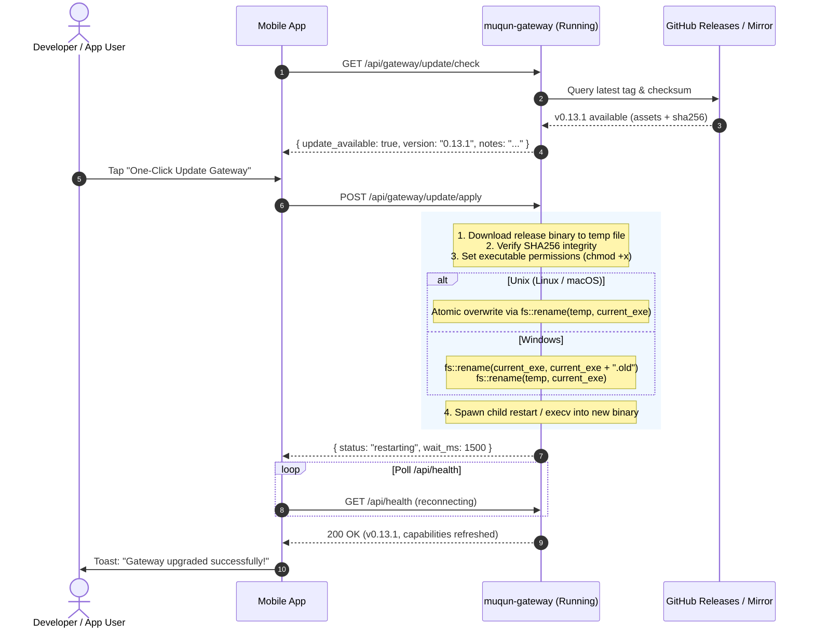

# Gateway Architecture & Evolution Specification

## 1. Architectural Vision & Core Philosophy

The Muqun Gateway serves as a resilient **Anti-Corruption Layer (ACL)** and **Capability-Negotiation Bridge** connecting developer desktop environments to the mobile client (`../app`).

### 1.1 Inverted Stability Principle
- **Mobile Client (`../app`)**: Deployments are constrained by mobile app store review cycles (Apple App Store / Google Play), enterprise distribution delays, and unpredictable user update cadence. Changing the mobile App contract requires extensive testing across screen form factors and OS releases.
- **Desktop Gateway (`muqun-gateway`)**: Deployed locally as a self-contained Rust binary on the developer machine. Iteration, bug fixing, and protocol adaptation have near-zero distribution latency.
- **Core Directive**: *All upstream protocol volatility, breaking schema migrations, and backend-specific idiosyncrasies must be absorbed entirely within the Gateway.* The external mobile API contract remains backward-compatible and frozen. When an upstream harness (such as OpenCode or DeepSeek Harness) alters its RPC signatures or event formats, only the Gateway binary is upgraded; the mobile client remains untouched.

### 1.2 Zero-Assumption Client (Capability-Driven Rendering)
The mobile App must never assume that a host machine has specific tools installed (e.g. `tmux`, `herdr`, or a particular AI coding harness). Instead, the Gateway exposes a dynamic, deterministic **Capability Matrix**. The mobile UI functions strictly as an adaptive renderer that enables, disables, or hides views based on active capabilities reported by the Gateway during session handshake.

---

## 2. High-Level System Architecture

The Gateway is organized around Hexagonal / Clean Architecture with two primary domain planes:

```text
               +---------------------------------------------+
               |         Mobile Client (../app)              |
               |  (Adaptive UI: Terminal, Agents, Workspaces)|
               +---------------------------------------------+
                                      |
                     REST APIs / SSE / Encrypted Wire
                                      v
+-------------------------------------------------------------------------+
|                              MUQUN GATEWAY                              |
|                                                                         |
|  +-------------------------------------------------------------------+  |
|  |                 Inbound HTTP Routes & Security                     |  |
|  |       (Auth, Pairing, AES-GCM Transport Encryption, SSE Hub)       |  |
|  +-------------------------------------------------------------------+  |
|                                     |                                   |
|       +-----------------------------+-----------------------------+     |
|       |                                                           |     |
|       v                                                           v     |
|  +---------------------------------+  +----------------------------------+
|  |      Terminal Control Plane     |  |       Agent Harness Plane        |
|  |  (TerminalBackend Port Seam)    |  |  (HarnessRegistry / Port Seam)   |
|  +---------------------------------+  +----------------------------------+
|       |                     |               |                       |   |
|       v                     v               v                       v   |
|  +---------+           +---------+     +----------+           +----------+
|  |  Herdr  |           |  Tmux   |     | OpenCode |           | DeepSeek |
|  | Adapter |           | Adapter |     | Adapter  |           | Adapter  |
|  +---------+           +---------+     +----------+           +----------+
|                                                                         |
|  +-------------------------------------------------------------------+  |
|  |               Capability Discovery & Self-Update Engine           |  |
|  |        (Matrix Computation, Release Checker, Hot-Restart)          |  |
|  +-------------------------------------------------------------------+  |
+-------------------------------------------------------------------------+
        |                     |               |                       |
        v                     v               v                       v
 [Herdr Unix Socket]      [tmux CLI]     [OpenCode HTTP]    [DeepSeek RPC/WS]
```

---

## 3. The Dual Domain Planes

### 3.1 Terminal Control Plane (`TerminalBackend`)
The Terminal plane manages interactive PTY workspaces, window multiplexing, scrollback capture, and command injection.

- **Port (`src/backend/model.rs`)**:
  Defines `TerminalBackend` with operations for inspecting topology (workspaces, tabs, panes), capturing output buffers, injecting key strokes, and observing activity streams.
- **Adapters**:
  - `HerdrAdapter`: Speaks Herdr JSON-line socket protocol (protocol 17+).
  - `TmuxAdapter`: Executes direct `tmux` argv commands without shell interpolation.
  - `WindowsConPtyAdapter` *(Roadmap)*: Windows Console Virtual Terminal / Named Pipe driver.
- **Graceful Terminal Degradation**:
  When a host machine lacks both `herdr` and `tmux` (e.g. minimal Windows environments or headless containers), the Gateway does not fail. It disables the `terminal` capability flag, and routes for PTY control respond with HTTP 501 / `BackendError::Unsupported`. The mobile App hides the Terminal navigation tab and transitions smoothly into a dedicated Agent workbench.

### 3.2 Agent Harness Plane (`AgentEnginePort` / `HarnessRegistry`)
The Agent Harness plane manages AI pair-programming sessions, conversation history, model routing, reasoning tiers, file diffs, tool execution approvals, and event streaming across one or more concurrent harnesses.

#### 3.2.1 Three-Tier Domain Hierarchy
To prevent conceptual confusion, the Gateway clearly separates:
1. **Harness Tier (Runtime Host)**:
   The execution daemon, tool sandbox, and protocol host.
   - Examples: DeepSeek Harness (`dsh`), OpenCode Service (`opencode service start`), Claude Code CLI.
   - Responsibilities: Bash command execution, file system read/write, LSP tool handling, session storage, and transport connection.
2. **Agent Tier (Persona / Behavioral Role)**:
   The role or prompt profile running inside a harness.
   - Examples: `coder`, `reviewer`, `architect`, `build`, `tester`.
   - Responsibilities: Task decomposition, prompt templates, and tool access permissions.
3. **Model Tier (Inference LLM)**:
   The foundation language model invoked for token generation.
   - Examples: `deepseek-chat`, `deepseek-reasoner`, `claude-3-7-sonnet`, `gpt-4o`.

#### 3.2.2 Port Definition (`src/agent/ports/engine.rs`)
`AgentEnginePort` unifies all harness behaviors across providers:
```rust
pub trait AgentEnginePort: Send + Sync {
    fn kind(&self) -> &'static str;
    fn probe(&self) -> EngineFuture<'_, bool>;
    fn list_projects(&self) -> EngineFuture<'_, Vec<AgentProject>>;
    fn list_sessions<'a>(&'a self, query: &'a SessionQuery) -> EngineFuture<'a, Vec<AgentSessionInfo>>;
    fn create_session<'a>(&'a self, directory: Option<&'a str>, model: Option<&'a ModelRef>, agent: Option<&'a str>) -> EngineFuture<'a, AgentSessionInfo>;
    fn get_session<'a>(&'a self, session_id: &'a str) -> EngineFuture<'a, AgentSessionInfo>;
    fn send_prompt<'a>(&'a self, session_id: &'a str, text: &'a str, attachments: &'a [String], delivery: Option<&'a str>) -> EngineFuture<'a, ()>;
    fn interrupt<'a>(&'a self, session_id: &'a str) -> EngineFuture<'a, ()>;
    fn switch_model<'a>(&'a self, session_id: &'a str, model: &'a ModelRef) -> EngineFuture<'a, ()>;
    fn get_catalog<'a>(&'a self, directory: Option<&'a str>) -> EngineFuture<'a, AgentCatalog>;
    fn get_timeline<'a>(&'a self, session_id: &'a str, limit: usize) -> EngineFuture<'a, Vec<TimelineItem>>;
    fn get_vcs_diff<'a>(&'a self, session_id: &'a str, mode: &'a str) -> EngineFuture<'a, Vec<FileDiffItem>>;
    fn reply_permission<'a>(&'a self, session_id: &'a str, request_id: &'a str, decision: PermissionDecision, message: Option<&'a str>) -> EngineFuture<'a, ()>;
    // ... optional capability extensions with default unsupported fallbacks
}
```

#### 3.2.3 Concurrent Multi-Harness Coexistence
A developer may have OpenCode running for one repository while DeepSeek Harness is running on port 3080 for deep reasoning tasks.
- **Concurrent Supervision**: Gateway supervises all enabled harnesses in parallel (`HarnessRegistry`).
- **Catalog Aggregation**: `GET /api/agent/catalog` gathers models and agents from all connected harnesses into a unified response.
- **Session Affinity**: When creating a session, the Gateway tags the session with its owning harness ID (`harness: "deepseek"` or `harness: "opencode"`).
- **Dynamic Dispatch**: When the mobile App sends prompts, aborts, or inspects diffs for a session, Gateway automatically dispatches to the corresponding harness driver.

---

## 4. Dynamic Capability Discovery & Negotiation

To eliminate the need for mobile App store updates when capabilities shift, the Gateway exposes a unified Capability Declaration on `GET /api/health` and `GET /api/meta`.

### 4.1 Capability Schema
```json
{
  "gateway_version": "0.13.0",
  "api_version": "1.4.0",
  "platform": "linux",
  "capabilities": {
    "terminal": {
      "supported": true,
      "backend": "tmux",
      "features": {
        "multi_window": true,
        "split_pane": true,
        "raw_pty": true
      }
    },
    "agent": {
      "supported": true,
      "provider": "deepseek",
      "version": "1.0.0",
      "features": {
        "streaming": true,
        "reasoning_effort": true,
        "model_selection": true,
        "worktree": false,
        "file_browser": true,
        "tool_approvals": true
      }
    },
    "harnesses": {
      "deepseek": {
        "connected": true,
        "endpoint": "http://127.0.0.1:3080",
        "models": ["deepseek-chat", "deepseek-reasoner"],
        "agents": ["default"]
      },
      "opencode": {
        "connected": true,
        "endpoint": "http://127.0.0.1:4096",
        "models": ["claude-3-7-sonnet"],
        "agents": ["build", "coder"]
      }
    },
    "workspace_fs": {
      "supported": true,
      "diff_preview": true,
      "file_upload": true
    },
    "self_update": {
      "supported": true,
      "channel": "stable",
      "update_available": false,
      "latest_version": "0.13.0"
    }
  }
}
```

### 4.2 Mobile Client Adaptive Rules
The mobile client parses the `capabilities` node upon initial pairing and reconnect:
1. **Terminal Tab Guard**:
   If `capabilities.terminal.supported == false`, the App removes the Terminal tab from the bottom navigation bar or displays an informational card explaining that the host runs in headless agent-only mode.
2. **Reasoning Effort Control**:
   If `capabilities.agent.features.reasoning_effort == true` (e.g. DeepSeek Harness with Flash/Pro models), the input composer dynamically reveals the thinking-depth picker (`Off`, `Low`, `High`, `Max`). If false (e.g. OpenCode standard presets), the UI hides this selector.
3. **Workspace Isolation & Worktrees**:
   If `capabilities.agent.features.worktree == false`, the App avoids rendering branch-isolation modals and operates directly within the primary workspace directory.
4. **Tool Call Visualization**:
   The Gateway projects engine-specific tool events into normalized metadata cards (e.g. `files` with diff additions/deletions, `exitCode` for shell executions). Even if a brand-new tool type is introduced upstream, the App falls back to generic readable text representation without crashing.

---

## 5. Self-Update Architecture & Zero-Friction Upgrades

Because updating the mobile client is expensive while updating the Gateway is trivial, the Gateway is designed with built-in **Self-Update** capabilities.

### 5.1 Cross-Platform In-Place Binary Replacement
Rust binaries can replace themselves on disk during runtime:



#### Unix (Linux / macOS) Mechanics
Unix file systems decouple a file's inode from its directory entry (`dentry`). An open and executing binary can be unlinked or overwritten via `fs::rename()`. Once replaced, the Gateway either calls `nix::unistd::execv()` to replace the process image in-place, or gracefully exits so the service supervisor (`systemd`, `launchd`, or container runtime) restarts it within milliseconds.

#### Windows Mechanics
Windows prevents overwriting an executing binary (`ERROR_SHARING_VIOLATION`), **but explicitly allows renaming an executing binary**.
The Gateway renames `muqun-gateway.exe` to `muqun-gateway.exe.old`, writes the new binary into `muqun-gateway.exe`, and schedules the removal of `.old` upon next launch.

---

## 6. Mobile App Upgrade & UX Flow

### 6.1 Non-Intrusive Banner (Standard Update)
When `update_available == true` and current API version is compatible:
- The App displays a subtle status pill or settings badge:
  `"Gateway v0.13.1 is available. Tap to upgrade."`
- The user's active workflow is never interrupted.

### 6.2 Capability-Gated Prompt (Feature Requires New Gateway)
When the user triggers a feature that requires a newer Gateway capability:
- The App intercepts the action before making an invalid call:
  - *Title*: "Gateway Update Required"
  - *Description*: "DeepSeek reasoning configuration requires Gateway v0.13.0 or newer. Your current version is v0.12.2."
  - *Action*: `[ Update Gateway Now ]` (Triggers `POST /api/gateway/update/apply` with seamless automatic reconnection).

---

## 7. Extension Protocol: Adding a New Harness Driver

To integrate any future harness (e.g. Claude Code, Pi AI, or custom internal engines), implement four isolated files under `src/agent/adapters/<harness_name>/`:

1. `endpoint.rs`: Connection metadata, health discovery, and credential loading.
2. `client.rs`: Transport communication (REST, JSON-RPC, or gRPC).
3. `stream.rs`: Server-Sent Events or WebSocket stream consumer.
4. `mapper.rs`: Pure bidirectional mapping between harness payloads and domain entities (`AgentSessionInfo`, `AgentCatalog`, `TimelineItem`, `ToolCall`).
5. Register the new driver into `AgentEnginePort` and `AgentRuntime` supervisor discovery.

**Result**: Zero changes to Axum HTTP route handlers, zero changes to mobile App schemas, and zero breaking changes for existing paired devices.

---

## 8. Configuration Architecture Reference

For complete configuration schemas, cascading resolution rules (CLI > Env > File > Auto-Discovery > Defaults), terminal multiplexer configs, and headless profiles, refer to the dedicated specification:
- [`docs/configuration.md`](configuration.md)
