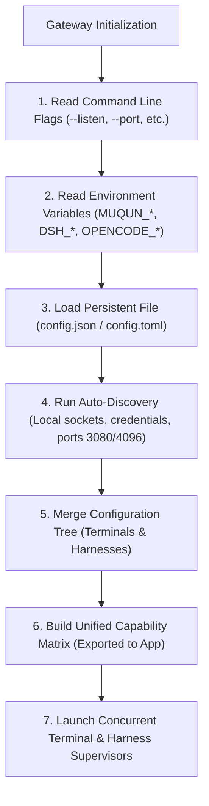

# Gateway Configuration Architecture & Extensibility Specification

This document defines the configuration architecture for `muqun-gateway`. It establishes how the Gateway coordinates Terminal Multiplexers and AI Agent Harnesses into a modular, cascading, and extensible configuration system while guaranteeing backward compatibility with existing installations.

---

## 1. Core Principles

1. **Zero-Config First (Automatic Discovery)**:
   A developer running `muqun-gateway` without manual configuration should have working harnesses and terminals automatically. The Gateway probes well-known ports, default Unix domain sockets, process registries, and local credential stores (e.g. `~/.dsh/.credentials.yaml` or running OpenCode services).
2. **Cascading Resolution Hierarchy**:
   Configuration values resolve in strict priority order:
   ```text
   CLI Flags  >  Environment Variables  >  Persistent Config File  >  Auto-Discovery  >  Built-in Defaults
   ```
3. **Decoupled Dual-Plane Modeling**:
   Terminal multiplexers and AI Agent harnesses are treated as independent, pluggable subsystems. A host machine with no terminal multiplexer (e.g. a minimal Windows install or headless container) can run pure Agent workflows without terminal configuration errors.
4. **Multi-Harness Coexistence (No Artificial Exclusivity)**:
   Developers routinely run multiple AI tools simultaneously (e.g., an OpenCode daemon for workspace indexing and a DeepSeek Harness daemon for intensive reasoning). The Gateway supervises and routes between multiple active harnesses concurrently rather than forcing a single global engine toggle.
5. **Strict Schema Backward Compatibility**:
   Existing `config.json` files generated by previous releases must deserialize cleanly without breaking. All new configuration fields use Serde defaults (`#[serde(default)]`) and omit serialization when set to defaults (`skip_serializing_if`).

---

## 2. Terminology: Harness vs. Agent vs. Model

Clear architectural boundaries prevent conceptual collisions between infrastructure layers and reasoning personas:

```text
+-----------------------------------------------------------------------------------+
|  1. Harness Tier (Runtime Host / Execution Daemon)                                |
|     - Manages process lifecycle, OS sandbox, bash execution, file I/O, LSP       |
|     - Exposes RPC / WebSocket / SSE transport endpoints                           |
|     - Examples: DeepSeek Harness (`dsh`), OpenCode Service, Claude Code CLI      |
+-----------------------------------------------------------------------------------+
                                         |
                                         v
+-----------------------------------------------------------------------------------+
|  2. Agent Tier (Persona / Behavioral Role)                                         |
|     - Executes INSIDE a Harness with a defined system prompt & tool policy        |
|     - Specializes in specific pair-programming workflows                          |
|     - Examples: `coder`, `reviewer`, `architect`, `build`, `tester`               |
+-----------------------------------------------------------------------------------+
                                         |
                                         v
+-----------------------------------------------------------------------------------+
|  3. Model Tier (Foundational LLM Engine)                                           |
|     - Inference completion backend invoked by the Harness / Agent                 |
|     - Examples: `deepseek-chat`, `deepseek-reasoner`, `claude-3-7-sonnet`, `gpt-4o`|
+-----------------------------------------------------------------------------------+
```

- **Harness**: The execution host and testbed container. OpenCode and DeepSeek Harness (`dsh`) are **Harnesses**, not individual agents.
- **Agent**: The persona or role running within a harness. OpenCode provides built-in agents (`build`, `coder`). DeepSeek Harness can execute general, review, or task-specialized subagents.
- **Model**: The LLM completion engine that produces text and tool calls.

---

## 3. Configuration Resolution Flow



---

## 4. Configuration Schema & Structural Model

The configuration schema separates global gateway network/security parameters from the two domain planes:

```text
Config
├── Global & Security (listen, public_url, transport_encryption, token_hash)
├── Terminal Plane (terminals: herdr, tmux, conpty)
└── Agent Harness Plane (harnesses: deepseek, opencode, claude...)
```

### 4.1 Rust Schema Specification

```rust
use std::collections::BTreeMap;
use serde::{Deserialize, Serialize};

/// Root Gateway Configuration
#[derive(Debug, Clone, Serialize, Deserialize)]
pub struct Config {
    pub server_id: String,
    pub label: String,
    pub listen: String,
    pub public_url: String,
    pub token_hash: String,

    #[serde(default, skip_serializing_if = "is_required_transport")]
    pub transport_encryption: TransportEncryptionMode,

    #[serde(default, skip_serializing_if = "is_false")]
    pub dev_unauthenticated: bool,

    /// Push notification strategy when an agent requires approval
    #[serde(default, skip_serializing_if = "is_false")]
    pub rich_agent_pushes: bool,

    /// Terminal plane multi-backend configuration
    #[serde(default)]
    pub terminal: TerminalPlaneConfig,

    /// Multi-harness AI configuration
    #[serde(default)]
    pub harnesses: HarnessPlaneConfig,

    /// Legacy OpenCode block for backward compatibility
    #[serde(default, skip_serializing_if = "is_default_opencode")]
    pub opencode: OpencodeConfig,

    /// Legacy DeepSeek block for backward compatibility
    #[serde(default, skip_serializing_if = "is_default_deepseek")]
    pub deepseek: DeepseekConfig,
}
```

---

## 5. Terminal Plane Configuration

The Terminal Plane abstracts physical terminal multiplexers and PTY carriers. Each backend has an explicit enable switch and connection parameters.

### 5.1 Terminal Configuration Schema

```rust
#[derive(Debug, Clone, Serialize, Deserialize)]
#[serde(rename_all = "snake_case")]
pub enum TerminalBackendKind {
    Herdr,
    Tmux,
    Conpty,   // Windows Console PTY
    Headless, // No-terminal mode
}

#[derive(Debug, Clone, Default, Serialize, Deserialize)]
pub struct TerminalPlaneConfig {
    /// Strategy: "auto" (probe herdr -> tmux -> conpty), "tmux", "herdr", "conpty", "none"
    #[serde(default = "default_auto")]
    pub mode: String,

    /// Tmux backend configuration
    #[serde(default)]
    pub tmux: TmuxConfig,

    /// Herdr backend configuration
    #[serde(default)]
    pub herdr: HerdrConfig,

    /// Windows ConPTY backend configuration
    #[serde(default)]
    pub conpty: ConptyConfig,
}

#[derive(Debug, Clone, Serialize, Deserialize)]
pub struct TmuxConfig {
    #[serde(default = "default_true")]
    pub enabled: bool,
    /// Custom path to tmux binary (default: resolved from PATH)
    #[serde(default, skip_serializing_if = "Option::is_none")]
    pub binary: Option<String>,
    /// Custom socket name or path (-L / -S)
    #[serde(default, skip_serializing_if = "Option::is_none")]
    pub socket: Option<String>,
    /// Polling interval for topology sync in milliseconds
    #[serde(default = "default_poll_ms")]
    pub poll_interval_ms: u64,
}

#[derive(Debug, Clone, Serialize, Deserialize)]
pub struct HerdrConfig {
    #[serde(default = "default_true")]
    pub enabled: bool,
    /// Path to Herdr Unix domain socket
    #[serde(default, skip_serializing_if = "Option::is_none")]
    pub socket_path: Option<String>,
    /// Connection timeout in seconds
    #[serde(default = "default_timeout_s")]
    pub timeout_seconds: u64,
}

#[derive(Debug, Clone, Serialize, Deserialize)]
pub struct ConptyConfig {
    #[serde(default = "default_true")]
    pub enabled: bool,
    /// Default Windows shell ("powershell.exe", "cmd.exe", or "pwsh.exe")
    #[serde(default = "default_win_shell")]
    pub default_shell: String,
    pub cols: u16,
    pub rows: u16,
}
```

### 5.2 Terminal Degradation
If no terminal multiplexer is discovered on the host or `mode == "none"`:
- Capability: `capabilities.terminal.supported = false`.
- Endpoints under `/api/workspace/*` and `/api/pane/*` return HTTP 501 `Not Implemented`.
- The mobile App automatically hides terminal tabs and PTY cards.

---

## 6. Agent Harness Plane Configuration

The Agent Harness Plane manages AI execution runtimes. Rather than selecting a single mutually exclusive engine, multiple harnesses can be active and supervised at the same time.

### 6.1 Multi-Harness Configuration Schema

```rust
#[derive(Debug, Clone, Default, Serialize, Deserialize)]
pub struct HarnessPlaneConfig {
    /// DeepSeek Harness adapter configuration
    #[serde(default)]
    pub deepseek: DeepseekConfig,

    /// OpenCode adapter configuration
    #[serde(default)]
    pub opencode: OpencodeConfig,

    /// Future extensible harness adapters (e.g. Claude Code, Custom)
    #[serde(default, skip_serializing_if = "BTreeMap::is_empty")]
    pub extra: BTreeMap<String, GenericHarnessConfig>,
}

#[derive(Debug, Clone, Default, Serialize, Deserialize)]
pub struct DeepseekConfig {
    /// Enable or disable DeepSeek Harness integration
    #[serde(default = "default_true")]
    pub enabled: bool,

    /// HTTP endpoint URL (default: auto-probe 127.0.0.1:3080 or 127.0.0.1:19387)
    #[serde(default, skip_serializing_if = "Option::is_none")]
    pub endpoint: Option<String>,

    /// Bearer authentication token if configured with static token
    #[serde(default, skip_serializing_if = "Option::is_none")]
    pub token: Option<String>,

    /// Session signing secret (auto-loaded from ~/.dsh/.credentials.yaml)
    #[serde(default, skip_serializing_if = "Option::is_none")]
    pub secret: Option<String>,

    /// Default reasoning effort tier for new sessions ("off", "low", "high", "max")
    #[serde(default, skip_serializing_if = "Option::is_none")]
    pub default_reasoning_effort: Option<String>,
}

#[derive(Debug, Clone, Serialize, Deserialize)]
pub struct OpencodeConfig {
    /// Enable or disable OpenCode integration
    #[serde(default = "default_true")]
    pub enabled: bool,

    /// Spawn `opencode service start` if no healthy service is currently running
    #[serde(default = "default_true")]
    pub autostart: bool,

    /// Custom binary location if not on standard PATH
    #[serde(default, skip_serializing_if = "Option::is_none")]
    pub binary: Option<String>,

    /// Explicit server endpoint URL (default: ephemeral auto-discovery)
    #[serde(default, skip_serializing_if = "Option::is_none")]
    pub endpoint: Option<String>,
}
```

### 6.2 Concurrent Multi-Harness Operation & Routing
1. **Parallel Health Supervision**:
   The Gateway continuously supervises all enabled harnesses (`enabled: true`). If OpenCode is restarted or DeepSeek Harness is started later, the Gateway connects to both without dropping existing sessions.
2. **Unified Catalog Aggregation**:
   When the mobile App calls `GET /api/agent/catalog`, the Gateway queries all active harnesses and merges their offerings into a unified catalog:
   - DeepSeek Harness contributes models (`deepseek-chat`, `deepseek-reasoner`) and its default agent persona.
   - OpenCode contributes models (`claude-3-7-sonnet`, `gpt-4o`) and role agents (`build`, `coder`).
3. **Session Affinity Routing**:
   Every session created via `POST /api/agent/session` records its designated harness ID (e.g. `"deepseek"` or `"opencode"`). Subsequent interactions (`send_prompt`, `timeline`, `diff`, `reply_permission`) route directly to the driver owning that session ID.

---

## 7. Real-World Configuration Profiles

### Profile A: Zero-Config Developer (Out of the Box)
No configuration file required.
- **Terminal**: Auto-discovers local `tmux` or `herdr`.
- **Harnesses**: Auto-probes local OpenCode (ephemeral port) and DeepSeek Harness (`127.0.0.1:3080`). Connects to all healthy instances concurrently.

### Profile B: Dual-Harness Coexistence (Linux/macOS with Tmux)
Developer uses OpenCode for general workspace coding and DeepSeek Harness for advanced reasoning on the same machine.
`config.json`:
```json
{
  "server_id": "srv_dev_box",
  "label": "Workstation (Dual Harness)",
  "listen": "0.0.0.0:4430",
  "public_url": "https://dev.example.ts.net",
  "token_hash": "...",
  "terminal": {
    "mode": "tmux",
    "tmux": {
      "enabled": true,
      "binary": "/usr/bin/tmux"
    }
  },
  "harnesses": {
    "deepseek": {
      "enabled": true,
      "endpoint": "http://127.0.0.1:3080",
      "default_reasoning_effort": "low"
    },
    "opencode": {
      "enabled": true,
      "autostart": true
    }
  }
}
```

### Profile C: Headless Windows Machine (Pure Agent Mode, No Tmux)
`config.json`:
```json
{
  "server_id": "srv_win_agent",
  "label": "Windows Desktop (Agent Only)",
  "listen": "127.0.0.1:4430",
  "public_url": "http://127.0.0.1:4430",
  "token_hash": "...",
  "terminal": {
    "mode": "none"
  },
  "harnesses": {
    "deepseek": {
      "enabled": true,
      "endpoint": "http://127.0.0.1:3080"
    },
    "opencode": {
      "enabled": false
    }
  }
}
```
**Outcome**:
- Gateway announces `capabilities.terminal.supported: false`.
- Gateway announces `capabilities.agent.supported: true`.
- Mobile client transitions straight into AI Agent mode without showing broken terminal views.

---

## 8. How to Add a New Terminal Backend or Harness Driver

### 8.1 Adding a New Terminal Backend (e.g. Windows ConPTY)
1. Define the backend configuration struct in `src/backend/conpty/config.rs`.
2. Implement the `TerminalBackend` trait (`src/backend/model.rs`).
3. Add the variant to `TerminalBackendKind` with default fallbacks.
4. Register the backend in `src/backend/registry.rs`.

### 8.2 Adding a New Harness Driver (e.g. Claude Code / Pi AI)
1. Add the harness configuration block (e.g. `ClaudeConfig`) to `src/agent/runtime.rs`.
2. Implement `AgentEnginePort` in `src/agent/adapters/claude/driver.rs`.
3. Register the driver in the multi-harness supervisor loop.
4. The Axum HTTP routes and mobile client contract require **zero code changes**.
