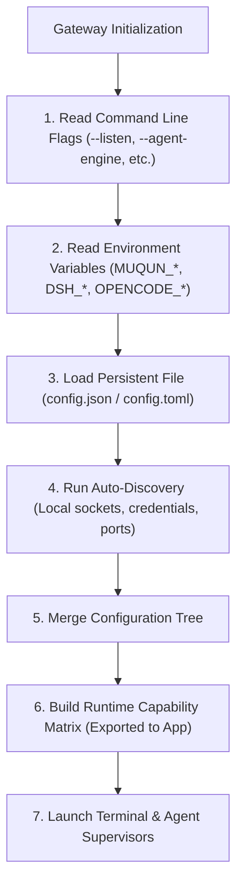

# Gateway Configuration Architecture & Extensibility Specification

This document defines the configuration architecture for `muqun-gateway`. It establishes how the Gateway unifies Terminal Backends and Agent Engines into a modular, cascading, and extensible configuration system while guaranteeing backward compatibility with existing installations.

---

## 1. Core Principles

1. **Zero-Config First (Automatic Discovery)**:
   A developer running `muqun-gateway` without manual configuration should have working agents and terminals automatically. The Gateway probes well-known ports, default Unix sockets, process registries, and local credential stores (e.g. `~/.dsh/.credentials.yaml` or running OpenCode services).
2. **Cascading Resolution Hierarchy**:
   Configuration values resolve in strict priority order:
   ```text
   CLI Flags  >  Environment Variables  >  Persistent Config File  >  Auto-Discovery  >  Built-in Defaults
   ```
3. **Decoupled Dual-Plane Modeling**:
   Terminal multiplexers and AI Agent engines are treated as independent, pluggable subsystems. A host machine with no terminal multiplexer (e.g. a minimal Windows install or headless container) can run pure Agent workflows without terminal configuration errors.
4. **Strict Schema Backward Compatibility**:
   Existing `config.json` files generated by previous releases must deserialize cleanly without breaking. All new configuration fields use Serde defaults (`#[serde(default)]`) and omit serialization when set to defaults (`skip_serializing_if`).

---

## 2. Configuration Resolution Flow



---

## 3. Configuration Schema & Structural Model

The configuration schema separates global gateway network/security parameters from the two domain planes:

```text
Config
├── Global & Security (listen, public_url, transport_encryption, token_hash)
├── Terminal Plane (terminals, active_backend, autostart_backends)
└── Agent Engine Plane (agents, active_engine)
```

### 3.1 Rust Schema Specification

```rust
use std::collections::BTreeMap;
use serde::{Deserialize, Serialize};

/// Root Gateway Configuration
#[derive(Debug, Clone, Serialize, Deserialize)]
pub struct Config {
    pub server_id: String,
    pub label: String,
    pub listen: String,
    pub public_url: String,
    pub token_hash: String,

    #[serde(default, skip_serializing_if = "is_required_transport")]
    pub transport_encryption: TransportEncryptionMode,

    #[serde(default, skip_serializing_if = "is_false")]
    pub dev_unauthenticated: bool,

    /// Configured terminal sessions / backends
    #[serde(default, skip_serializing_if = "Vec::is_empty")]
    pub sessions: Vec<SessionConfig>,

    /// Session IDs to start automatically on Gateway launch
    #[serde(default, skip_serializing_if = "Vec::is_empty")]
    pub autostart_backends: Vec<String>,

    /// Terminal plane global configuration
    #[serde(default)]
    pub terminal: TerminalPlaneConfig,

    /// Agent engine plane global configuration
    #[serde(default)]
    pub agent: AgentPlaneConfig,

    /// Legacy OpenCode block for backward compatibility
    #[serde(default, skip_serializing_if = "is_default_opencode")]
    pub opencode: OpencodeConfig,

    /// DeepSeek Harness block
    #[serde(default, skip_serializing_if = "is_default_deepseek")]
    pub deepseek: DeepseekConfig,
}
```

---

## 4. Terminal Plane Configuration

The Terminal Plane abstracts physical terminal multiplexers and PTY carriers.

### 4.1 Terminal Configuration Schema

```rust
#[derive(Debug, Clone, Serialize, Deserialize)]
#[serde(rename_all = "snake_case")]
pub enum TerminalBackendKind {
    Herdr,
    Tmux,
    Conpty,   // Windows Console PTY
    Headless, // No-terminal mode
}

#[derive(Debug, Clone, Default, Serialize, Deserialize)]
pub struct TerminalPlaneConfig {
    /// Active terminal backend strategy: "auto", "tmux", "herdr", "conpty", "none"
    #[serde(default = "default_auto")]
    pub mode: String,

    /// Specific configuration per backend kind
    #[serde(default)]
    pub tmux: TmuxConfig,

    #[serde(default)]
    pub herdr: HerdrConfig,

    #[serde(default)]
    pub conpty: ConptyConfig,
}

#[derive(Debug, Clone, Serialize, Deserialize)]
pub struct TmuxConfig {
    /// Custom path to the tmux executable (default: resolved from PATH)
    #[serde(default, skip_serializing_if = "Option::is_none")]
    pub binary: Option<String>,
    /// Custom tmux socket name or path (-L / -S)
    #[serde(default, skip_serializing_if = "Option::is_none")]
    pub socket: Option<String>,
    /// Polling interval for topology sync in milliseconds (default: 1000)
    #[serde(default = "default_poll_ms")]
    pub poll_interval_ms: u64,
}

#[derive(Debug, Clone, Serialize, Deserialize)]
pub struct HerdrConfig {
    /// Path to Herdr Unix domain socket
    #[serde(default, skip_serializing_if = "Option::is_none")]
    pub socket_path: Option<String>,
    /// Connection timeout in seconds (default: 5)
    #[serde(default = "default_timeout_s")]
    pub timeout_seconds: u64,
}

#[derive(Debug, Clone, Serialize, Deserialize)]
pub struct ConptyConfig {
    /// Default Windows shell ("powershell.exe", "cmd.exe", or "pwsh.exe")
    #[serde(default = "default_win_shell")]
    pub default_shell: String,
    /// Initial terminal columns (default: 120)
    #[serde(default = "default_cols")]
    pub cols: u16,
    /// Initial terminal rows (default: 40)
    #[serde(default = "default_rows")]
    pub rows: u16,
}
```

### 4.2 Terminal Capabilities Mapping
- If `mode == "none"` or no terminal multiplexer is discovered on the host:
  - Gateway capability: `capabilities.terminal.supported = false`
  - Routes under `/api/workspace/*`, `/api/pane/*` gracefully return `501 Not Implemented`.
  - The mobile App hides all terminal tabs and PTY interaction cards.

---

## 5. Agent Engine Plane Configuration

The Agent Plane unifies multi-engine AI adapters. It enables developers to switch or combine engines without altering the mobile client.

### 5.1 Agent Configuration Schema

```rust
#[derive(Debug, Clone, Default, Serialize, Deserialize)]
pub struct AgentPlaneConfig {
    /// Active engine selection: "auto", "deepseek", "opencode", "none"
    /// "auto" probes DeepSeek and OpenCode in order and adopts the healthy instance.
    #[serde(default = "default_auto")]
    pub active_engine: String,

    /// Push notification strategy when an agent requires approval
    #[serde(default, skip_serializing_if = "is_false")]
    pub rich_agent_pushes: bool,

    /// DeepSeek Harness engine adapter settings
    #[serde(default)]
    pub deepseek: DeepseekConfig,

    /// OpenCode engine adapter settings
    #[serde(default)]
    pub opencode: OpencodeConfig,
}

#[derive(Debug, Clone, Default, Serialize, Deserialize)]
pub struct DeepseekConfig {
    /// Explicitly enable or prioritize DeepSeek Harness
    #[serde(default)]
    pub enabled: bool,

    /// DeepSeek Harness HTTP endpoint (default: auto-discover 127.0.0.1:3080 or 127.0.0.1:19387)
    #[serde(default, skip_serializing_if = "Option::is_none")]
    pub endpoint: Option<String>,

    /// Bearer authentication token if configured with static token
    #[serde(default, skip_serializing_if = "Option::is_none")]
    pub token: Option<String>,

    /// Browser-session HMAC signing secret (from ~/.dsh/.credentials.yaml)
    #[serde(default, skip_serializing_if = "Option::is_none")]
    pub secret: Option<String>,

    /// Default reasoning effort tier for new sessions ("off", "low", "high", "max")
    #[serde(default, skip_serializing_if = "Option::is_none")]
    pub default_reasoning_effort: Option<String>,
}

#[derive(Debug, Clone, Serialize, Deserialize)]
pub struct OpencodeConfig {
    /// Spawn `opencode service start` if no service is running
    #[serde(default = "default_true")]
    pub autostart: bool,

    /// Custom binary location if not on standard PATH
    #[serde(default, skip_serializing_if = "Option::is_none")]
    pub binary: Option<String>,

    /// Explicit server endpoint URL
    #[serde(default, skip_serializing_if = "Option::is_none")]
    pub endpoint: Option<String>,
}
```

---

## 6. Real-World Configuration Profiles

### Profile A: Zero-Config Developer (Out of the Box)
No configuration file required.
- **Terminal**: Auto-discovers local `tmux` or `herdr`.
- **Agent**: Auto-probes local OpenCode (ephemeral port) and DeepSeek Harness (`127.0.0.1:3080`). Adopts the first available engine.

### Profile B: Linux/macOS with Tmux and DeepSeek Harness
`config.json`:
```json
{
  "server_id": "srv_dev_box",
  "label": "Workstation (Linux)",
  "listen": "0.0.0.0:4430",
  "public_url": "https://dev.example.ts.net",
  "token_hash": "...",
  "terminal": {
    "mode": "tmux",
    "tmux": {
      "binary": "/usr/bin/tmux"
    }
  },
  "agent": {
    "active_engine": "deepseek",
    "deepseek": {
      "endpoint": "http://127.0.0.1:3080",
      "default_reasoning_effort": "low"
    }
  }
}
```

### Profile C: Headless Windows Machine (Pure Agent Mode, No Tmux)
`config.json`:
```json
{
  "server_id": "srv_win_agent",
  "label": "Windows Desktop (Agent Only)",
  "listen": "127.0.0.1:4430",
  "public_url": "http://127.0.0.1:4430",
  "token_hash": "...",
  "terminal": {
    "mode": "none"
  },
  "agent": {
    "active_engine": "deepseek",
    "deepseek": {
      "endpoint": "http://127.0.0.1:3080"
    }
  }
}
```
**Outcome**:
- Gateway announces `capabilities.terminal.supported: false`.
- Gateway announces `capabilities.agent.supported: true`.
- Mobile client loads directly into AI Agent conversation mode without rendering broken terminal views.

---

## 7. How to Add a New Terminal Backend or Agent Engine

### 7.1 Adding a New Terminal Backend (e.g. Windows ConPTY)
1. Define the backend configuration struct in `src/backend/conpty/config.rs`.
2. Implement the `TerminalBackend` trait (`src/backend/model.rs`).
3. Add the variant to `TerminalBackendKind` with default fallbacks.
4. Register the backend in `src/backend/registry.rs`.

### 7.2 Adding a New Agent Engine (e.g. Claude Code / Pi AI)
1. Add the engine configuration block (e.g. `ClaudeConfig`) to `src/agent/runtime.rs`.
2. Implement `AgentEnginePort` in `src/agent/adapters/claude/driver.rs`.
3. Add discovery logic in `AgentRuntime::check_and_repair()`.
4. The Axum HTTP routes and mobile client contract require **zero code changes**.
